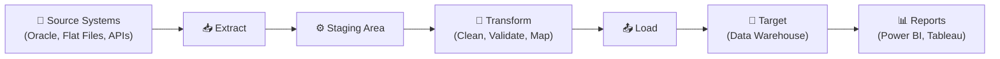

# 📖 ETL & SQL — Complete Learning Guide

<div class="section-banner">
  <span class="banner-icon">📘</span>
  <span class="banner-text">This is your main study resource. It covers ETL fundamentals, SQL concepts, and data validation techniques — everything you need for the interview. Read through it sequentially or jump to any section from the sidebar.</span>
</div>

---

## What is ETL?

**ETL** stands for **Extract, Transform, Load** — the three fundamental stages of moving data from source systems into a target system (typically a data warehouse or reporting database).

| Stage | What Happens | Example |
|-------|-------------|---------|
| **Extract** | Pull raw data from source systems | Read customer records from an Oracle CRM database |
| **Transform** | Clean, validate, and reshape data | Convert dates from `MM/DD/YYYY` to `YYYY-MM-DD`, remove duplicates |
| **Load** | Write transformed data into the target system | Insert cleaned records into a SQL Server data warehouse |

### Why ETL Matters

In banking and retail, ETL pipelines are the backbone of reporting. If the ETL is wrong:
- **Banking:** Financial reports show incorrect balances → regulatory risk
- **Retail:** Inventory reports are off → stockouts or overstocking
- **Both:** Business decisions are made on bad data

### ETL vs ELT

| Feature | ETL | ELT |
|---------|-----|-----|
| Transform location | In a staging area before loading | Inside the target database after loading |
| Best for | Traditional data warehouses | Cloud platforms (Snowflake, BigQuery) |
| Performance | Slower for large datasets | Leverages target system's processing power |
| Data volume | Small to medium | Large to very large |

> **Interview tip:** Know the difference. If asked, say: "ETL transforms data before loading into the target, while ELT loads raw data first and transforms it inside the target system using its native processing power."

---

## ETL Architecture



### Data Flow Layers

1. **Source Layer** — Original data from operational systems (CRM, banking core, POS systems)
2. **Staging Layer** — Temporary holding area where raw data lands first (no transformations yet)
3. **Transformation Layer** — Business rules applied: data cleaning, type conversions, lookups, aggregations
4. **Target Layer** — Final destination: data warehouse, data mart, or reporting database

### Common ETL Tools

| Tool | Vendor | Type |
|------|--------|------|
| **Informatica PowerCenter** | Informatica | Enterprise ETL |
| **IBM DataStage** | IBM | Enterprise ETL |
| **SSIS** | Microsoft | SQL Server Integration Services |
| **Talend** | Talend | Open-source ETL |
| **Azure Data Factory** | Microsoft | Cloud ETL/ELT |
| **AWS Glue** | Amazon | Cloud ETL |

> **Note:** You don't need to know how to use these tools for this interview — just be aware they exist and what they do.

---

## Data Transformation Types

Transformations are the core of ETL. Here are the most common types you'll be asked about:

### 1. Data Cleaning
- Removing leading/trailing spaces
- Standardizing NULL vs empty string vs 'N/A'
- Fixing inconsistent casing (e.g., 'NEW YORK' vs 'New York')

### 2. Data Type Conversion
- `VARCHAR` → `DATE` (parsing date strings)
- `VARCHAR` → `DECIMAL` (for monetary amounts)
- Handling precision loss in numeric conversions

### 3. Deduplication
- Removing exact duplicates
- Handling near-duplicates (e.g., "John Smith" vs "JOHN SMITH")
- Defining business rules for which record to keep

### 4. Lookup / Reference Data Enrichment
- Replacing codes with descriptions (e.g., state code 'TX' → 'Texas')
- Joining with dimension tables to get surrogate keys
- Currency conversion using lookup tables

### 5. Aggregation
- Summarizing transaction-level data into daily/monthly totals
- Calculating running balances
- Computing averages, counts, sums

### 6. Derived Columns
- Calculating `Age` from `Date_of_Birth`
- Creating `Full_Name` from `First_Name` + `Last_Name`
- Deriving `Account_Status` from business rules

### 7. Filtering
- Excluding test accounts or inactive records
- Date-range filtering (only load last 30 days)
- Status-based filtering (only active customers)

---

## Data Validation Techniques

As an ETL Tester, data validation is your primary responsibility. Here are the key validation types:

### Row Count Validation
Compare the number of records at each layer:

```sql
-- Source count
SELECT COUNT(*) AS source_count FROM source_db.customers;

-- Target count
SELECT COUNT(*) AS target_count FROM target_db.dim_customer;
```

If counts don't match, investigate filtering rules, duplicates, or rejected records.

### Data Completeness
Ensure no critical data is lost:

```sql
-- Check for NULLs in mandatory columns
SELECT COUNT(*) AS null_count
FROM target_db.dim_customer
WHERE customer_name IS NULL
   OR customer_id IS NULL
   OR account_number IS NULL;
```

### Data Integrity (Referential Integrity)
Ensure every foreign key has a matching primary key:

```sql
-- Find orphan transactions (no matching account)
SELECT t.transaction_id, t.account_id
FROM target_db.fact_transaction t
LEFT JOIN target_db.dim_account a ON t.account_id = a.account_id
WHERE a.account_id IS NULL;
```

### Transformation Validation
Verify that business rules are applied correctly:

```sql
-- Verify full name derivation
SELECT first_name, last_name, full_name
FROM target_db.dim_customer
WHERE full_name != CONCAT(first_name, ' ', last_name);
```

### Duplicate Check
Ensure unique records in the target:

```sql
-- Find duplicate customer records
SELECT customer_id, COUNT(*) AS cnt
FROM target_db.dim_customer
GROUP BY customer_id
HAVING COUNT(*) > 1;
```

### Data Reconciliation
Compare summary totals between source and target:

```sql
-- Source total
SELECT SUM(amount) AS source_total FROM source_db.transactions WHERE txn_date = '2024-01-15';

-- Target total
SELECT SUM(amount) AS target_total FROM target_db.fact_transaction WHERE txn_date = '2024-01-15';
```

---

## SQL Fundamentals

### SELECT, WHERE, ORDER BY

```sql
-- Basic query structure
SELECT column1, column2, column3
FROM table_name
WHERE condition
ORDER BY column1 ASC;

-- Example: Get active customers from Texas
SELECT customer_id, customer_name, state, status
FROM dim_customer
WHERE state = 'TX'
  AND status = 'Active'
ORDER BY customer_name;
```

### Filtering with Multiple Conditions

```sql
-- AND, OR, IN, BETWEEN, LIKE
SELECT *
FROM fact_transaction
WHERE account_type IN ('Savings', 'Checking')
  AND amount BETWEEN 100 AND 5000
  AND txn_date >= '2024-01-01'
  AND merchant_name LIKE '%Walmart%';
```

### GROUP BY and Aggregate Functions

```sql
-- COUNT, SUM, AVG, MIN, MAX
SELECT
    account_type,
    COUNT(*) AS total_transactions,
    SUM(amount) AS total_amount,
    AVG(amount) AS avg_amount,
    MIN(amount) AS min_amount,
    MAX(amount) AS max_amount
FROM fact_transaction
WHERE txn_date >= '2024-01-01'
GROUP BY account_type
ORDER BY total_amount DESC;
```

### HAVING — Filtering Aggregated Results

```sql
-- WHERE filters rows BEFORE aggregation
-- HAVING filters AFTER aggregation

SELECT customer_id, COUNT(*) AS order_count
FROM fact_orders
GROUP BY customer_id
HAVING COUNT(*) > 10;  -- Only customers with more than 10 orders
```

---

## JOINs

JOINs are the most important SQL concept for ETL testing. You'll use them constantly to compare data across tables.

### INNER JOIN
Returns only rows that have matching values in **both** tables.

```sql
SELECT c.customer_name, o.order_id, o.amount
FROM dim_customer c
INNER JOIN fact_orders o ON c.customer_id = o.customer_id;
```

### LEFT JOIN (LEFT OUTER JOIN)
Returns **all** rows from the left table + matching rows from the right. If no match, right side is NULL.

```sql
-- Find customers who have NEVER placed an order
SELECT c.customer_id, c.customer_name, o.order_id
FROM dim_customer c
LEFT JOIN fact_orders o ON c.customer_id = o.customer_id
WHERE o.order_id IS NULL;
```

> **ETL Use Case:** This is the #1 query for finding **missing records** — customers in source but not in target.

### RIGHT JOIN
Returns **all** rows from the right table. Rarely used — just reverse the table order and use LEFT JOIN instead.

### FULL OUTER JOIN
Returns **all** rows from both tables. NULLs where there's no match.

```sql
-- Find mismatches in both directions
SELECT
    s.customer_id AS source_id,
    t.customer_id AS target_id,
    s.customer_name AS source_name,
    t.customer_name AS target_name
FROM source_customers s
FULL OUTER JOIN target_customers t ON s.customer_id = t.customer_id
WHERE s.customer_id IS NULL OR t.customer_id IS NULL;
```

### CROSS JOIN
Every row from table A paired with every row from table B. Rarely used in ETL, but know what it is.

### SELF JOIN
A table joined to itself. Used for hierarchical data (e.g., employee → manager).

```sql
SELECT e.employee_name, m.employee_name AS manager_name
FROM employees e
LEFT JOIN employees m ON e.manager_id = m.employee_id;
```

### JOIN Summary Table

| JOIN Type | Returns | NULL behavior |
|-----------|---------|---------------|
| **INNER** | Only matching rows | No NULLs |
| **LEFT** | All left + matching right | NULLs for non-matching right |
| **RIGHT** | All right + matching left | NULLs for non-matching left |
| **FULL OUTER** | All from both | NULLs on both sides for non-matches |
| **CROSS** | Cartesian product | No NULLs (every combo) |

---

## Subqueries

### Non-Correlated Subquery (runs once)

```sql
-- Find all customers who placed orders above the average amount
SELECT customer_id, amount
FROM fact_orders
WHERE amount > (SELECT AVG(amount) FROM fact_orders);
```

### Correlated Subquery (runs once per outer row)

```sql
-- Find the latest order for each customer
SELECT customer_id, order_id, amount
FROM fact_orders o1
WHERE order_date = (
    SELECT MAX(order_date)
    FROM fact_orders o2
    WHERE o2.customer_id = o1.customer_id
);
```

### IN vs EXISTS

```sql
-- Using IN (better for small result sets)
SELECT * FROM dim_customer
WHERE customer_id IN (SELECT customer_id FROM fact_orders);

-- Using EXISTS (better for large result sets)
SELECT * FROM dim_customer c
WHERE EXISTS (SELECT 1 FROM fact_orders o WHERE o.customer_id = c.customer_id);
```

---

## Window Functions

Window functions are powerful for ETL testing — they let you do calculations across rows **without collapsing** the result set like GROUP BY does.

### ROW_NUMBER, RANK, DENSE_RANK

```sql
SELECT
    customer_id,
    order_date,
    amount,
    ROW_NUMBER() OVER (PARTITION BY customer_id ORDER BY order_date DESC) AS row_num,
    RANK()       OVER (PARTITION BY customer_id ORDER BY amount DESC)     AS rank_val,
    DENSE_RANK() OVER (PARTITION BY customer_id ORDER BY amount DESC)     AS dense_rank_val
FROM fact_orders;
```

| Function | Ties | Gaps |
|----------|------|------|
| **ROW_NUMBER** | No ties — always unique | No gaps |
| **RANK** | Same rank for ties | Gaps after ties (1, 2, 2, 4) |
| **DENSE_RANK** | Same rank for ties | No gaps (1, 2, 2, 3) |

### LEAD and LAG

```sql
-- Compare each transaction with the previous one for the same account
SELECT
    account_id,
    txn_date,
    amount,
    LAG(amount, 1) OVER (PARTITION BY account_id ORDER BY txn_date) AS prev_amount,
    amount - LAG(amount, 1) OVER (PARTITION BY account_id ORDER BY txn_date) AS change
FROM fact_transaction;
```

### Running Totals

```sql
SELECT
    account_id,
    txn_date,
    amount,
    SUM(amount) OVER (PARTITION BY account_id ORDER BY txn_date) AS running_total
FROM fact_transaction;
```

> **ETL Use Case:** Running totals are critical in banking — verify that the running balance matches expected balances at each point in time.

---

## Common Table Expressions (CTEs) and Temp Tables

### CTE (WITH clause)

```sql
WITH high_value_customers AS (
    SELECT customer_id, SUM(amount) AS total_spent
    FROM fact_orders
    GROUP BY customer_id
    HAVING SUM(amount) > 10000
)
SELECT c.customer_name, h.total_spent
FROM dim_customer c
INNER JOIN high_value_customers h ON c.customer_id = h.customer_id
ORDER BY h.total_spent DESC;
```

### Temp Tables

```sql
-- Create a temp table for validation
SELECT customer_id, COUNT(*) AS order_count
INTO #customer_orders
FROM fact_orders
GROUP BY customer_id;

-- Use it in a join
SELECT c.customer_name, t.order_count
FROM dim_customer c
INNER JOIN #customer_orders t ON c.customer_id = t.customer_id;

-- Clean up
DROP TABLE #customer_orders;
```

---

## NULL Handling

NULLs are one of the biggest sources of ETL bugs. Know these inside out:

```sql
-- IS NULL / IS NOT NULL (don't use = NULL!)
SELECT * FROM dim_customer WHERE phone IS NULL;

-- COALESCE — returns first non-NULL value
SELECT COALESCE(phone, mobile, 'No Phone') AS contact_number
FROM dim_customer;

-- ISNULL (SQL Server specific)
SELECT ISNULL(phone, 'N/A') FROM dim_customer;

-- NULLIF — returns NULL if the two values are equal
SELECT NULLIF(status, 'Unknown') FROM dim_customer;
-- Returns NULL if status = 'Unknown', otherwise returns the status value
```

### NULL Gotchas

| Expression | Result |
|-----------|--------|
| `NULL = NULL` | NULL (not TRUE!) |
| `NULL != NULL` | NULL (not TRUE!) |
| `NULL + 100` | NULL |
| `NULL AND TRUE` | NULL |
| `NULL OR TRUE` | TRUE |
| `COUNT(*)` | Counts all rows including NULLs |
| `COUNT(column)` | Counts only non-NULL values |

---

## UNION vs UNION ALL

```sql
-- UNION removes duplicates (slower)
SELECT customer_id FROM source_a
UNION
SELECT customer_id FROM source_b;

-- UNION ALL keeps all rows including duplicates (faster)
SELECT customer_id FROM source_a
UNION ALL
SELECT customer_id FROM source_b;
```

> **ETL Use Case:** Use UNION ALL when combining data from multiple source systems into staging (you want all records). Use UNION when you need distinct values for validation.

---

## CASE WHEN Statements

```sql
SELECT
    customer_id,
    total_balance,
    CASE
        WHEN total_balance >= 100000 THEN 'Platinum'
        WHEN total_balance >= 50000  THEN 'Gold'
        WHEN total_balance >= 10000  THEN 'Silver'
        ELSE 'Standard'
    END AS customer_tier
FROM dim_customer;
```

> **ETL Use Case:** CASE expressions are used extensively in ETL transformations for deriving categories, mapping codes to descriptions, and implementing business rules.

---

## String Functions

| Function | Example | Result |
|----------|---------|--------|
| `CONCAT` | `CONCAT('John', ' ', 'Smith')` | `John Smith` |
| `UPPER` | `UPPER('hello')` | `HELLO` |
| `LOWER` | `LOWER('HELLO')` | `hello` |
| `TRIM` | `TRIM('  hello  ')` | `hello` |
| `LTRIM / RTRIM` | `LTRIM('  hello')` | `hello` |
| `SUBSTRING` | `SUBSTRING('Hello World', 1, 5)` | `Hello` |
| `LEN / LENGTH` | `LEN('Hello')` | `5` |
| `REPLACE` | `REPLACE('2024/01/15', '/', '-')` | `2024-01-15` |
| `CHARINDEX` | `CHARINDEX('@', 'user@email.com')` | `5` |
| `LEFT / RIGHT` | `LEFT('Hello World', 5)` | `Hello` |

---

## Date Functions

| Function (SQL Server) | Example | Description |
|----------------------|---------|-------------|
| `GETDATE()` | `SELECT GETDATE()` | Current date/time |
| `DATEADD` | `DATEADD(day, 7, '2024-01-01')` | Add 7 days |
| `DATEDIFF` | `DATEDIFF(day, '2024-01-01', '2024-01-15')` | 14 days difference |
| `CONVERT` | `CONVERT(VARCHAR, GETDATE(), 112)` | Format as YYYYMMDD |
| `FORMAT` | `FORMAT(GETDATE(), 'yyyy-MM-dd')` | Custom format |
| `YEAR/MONTH/DAY` | `YEAR('2024-03-15')` | Extract year (2024) |
| `EOMONTH` | `EOMONTH('2024-02-15')` | Last day of month |

---

## Indexes — Quick Conceptual Overview

- An **index** is like a book's index — it helps SQL find data faster without scanning every row
- **Clustered index** — physically sorts the table data (only one per table)
- **Non-clustered index** — separate structure pointing to data (can have many)
- Indexes **speed up** SELECT and WHERE queries
- Indexes **slow down** INSERT, UPDATE, DELETE (because the index must be updated too)

> **Interview tip:** You don't need to know how to create indexes, but know what they are and the trade-off between read and write performance.

---

## Key Terminology

| Term | Definition |
|------|-----------|
| **Source System** | The original database or file where data comes from |
| **Target System** | The destination (data warehouse, data mart) |
| **Staging Area** | Temporary storage between source and target |
| **Source-to-Target Mapping** | Document that defines how source columns map to target columns |
| **Surrogate Key** | System-generated unique ID in the target (not from source) |
| **Natural Key** | Business key from the source data (e.g., SSN, account number) |
| **SCD Type 1** | Overwrite old data (no history kept) |
| **SCD Type 2** | Keep history with start/end dates and active flag |
| **Incremental Load** | Only load new or changed records since last run |
| **Full Load** | Reload all data from scratch |
| **Data Lineage** | Tracing data from source to target through transformations |
| **Data Profiling** | Analyzing data to understand its structure, quality, and patterns |
| **Dimension Table** | Descriptive data (customers, products, dates) — changes slowly |
| **Fact Table** | Measurable events (transactions, orders) — grows rapidly |

---

<p style="text-align: center; color: #94a3b8; margin-top: 2rem; font-size: 0.85rem;">📖 This is your foundation — master these concepts and you'll handle any ETL/SQL interview question with confidence!</p>
