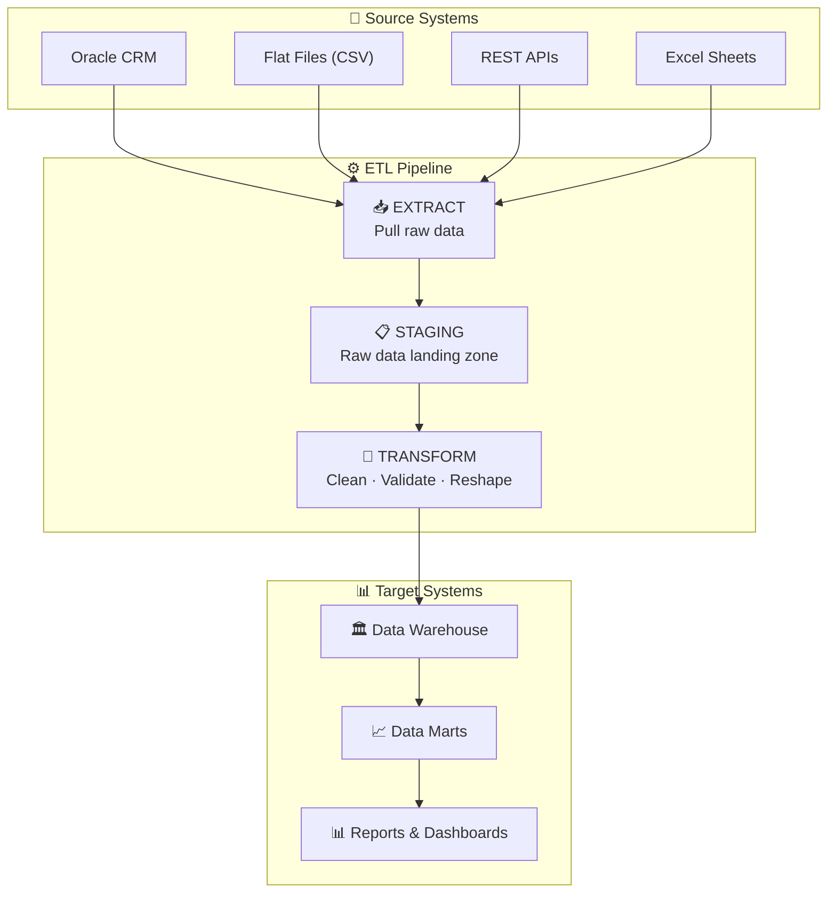
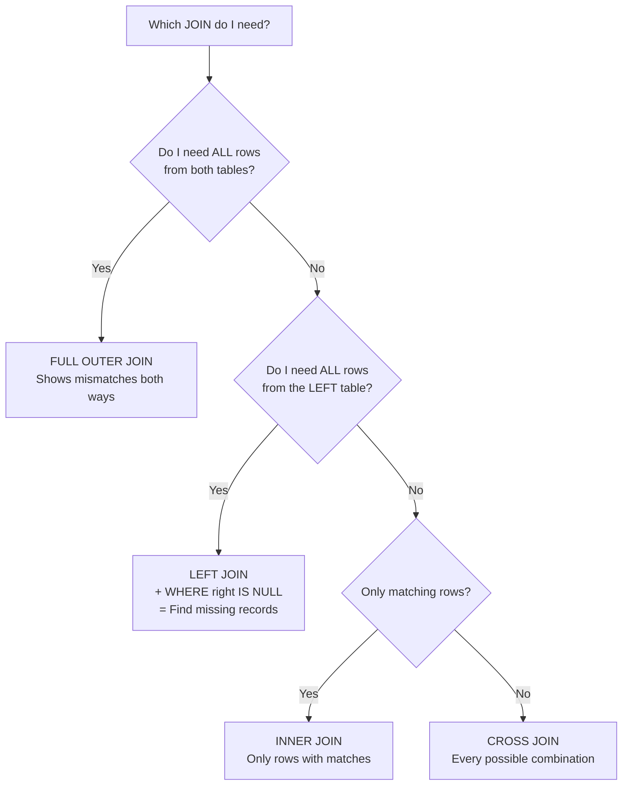
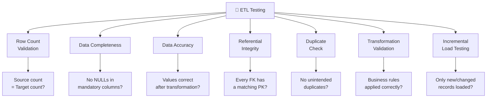
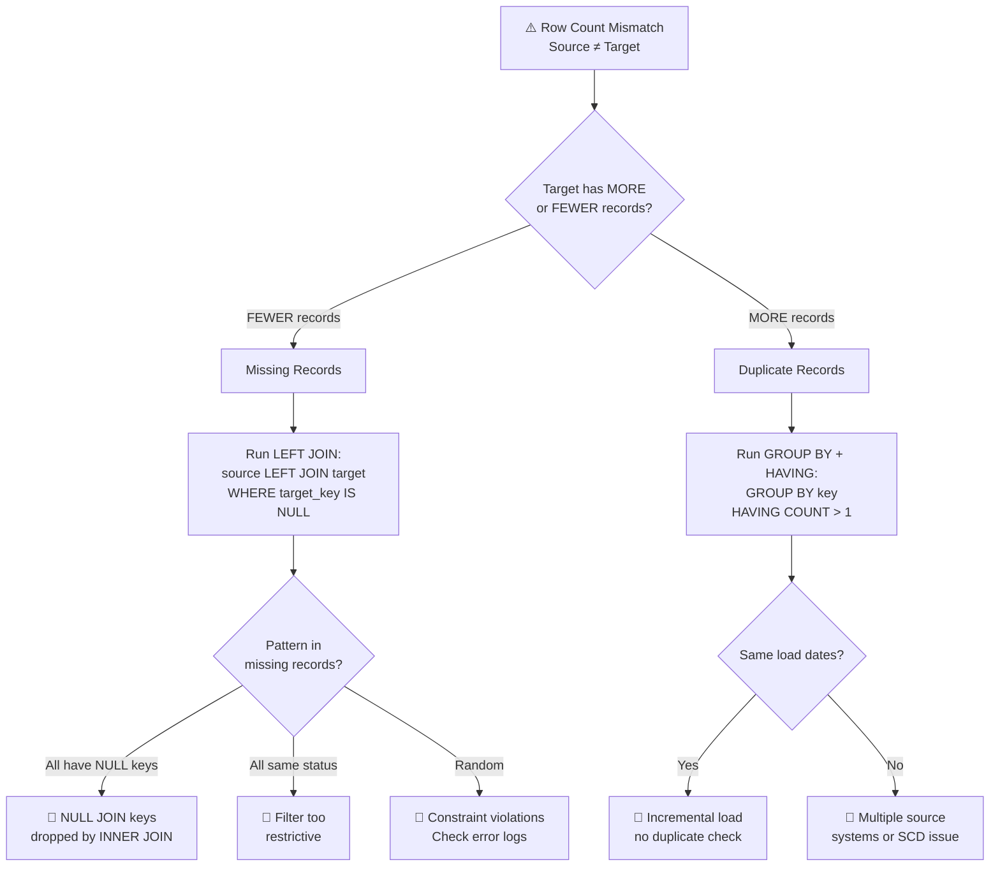

# 🧠 Mind Map & Visual Aids

  🗺️
  Visual diagrams, flow charts, and memory tricks to help you internalize key concepts. A picture is worth a thousand words — especially during an interview!

---

## ETL Architecture — The Big Picture

---

## SQL JOIN Types — Visual Decision Guide

---

## ETL Testing Types — Hierarchy

---

## Data Validation Decision Tree

*"I found a row count mismatch — now what?"*

---

## Window Functions Comparison — Quick Reference

  
Data: 100, 200, 200, 300

| Function | Result for 200 (first) | Result for 200 (second) | Result for 300 |
|----------|----------------------|------------------------|----------------|
| **ROW_NUMBER()** | 2 | 3 | 4 |
| **RANK()** | 2 | 2 | **4** (skips 3) |
| **DENSE_RANK()** | 2 | 2 | **3** (no skip) |

> 🧠 **Memory Trick:** "RANK **skips**, DENSE_RANK **doesn't skip**, ROW_NUMBER **never ties**"

---

## Memory Tricks & Mnemonics

  

    
🧠 ETL Validation Order

    
"Count, Dupe, Transform, Reference"

    
<strong>C</strong>ount rows → <strong>D</strong>up check → <strong>T</strong>ransformation verify → <strong>R</strong>eferential integrity. This is the order to validate after every ETL load.

  

  

    
🧠 NULL Rules

    
"NULL is NOT equal to ANYTHING"

    
NULL = NULL → NULL (not TRUE!). NULL + 100 → NULL. Always use IS NULL, never = NULL. COUNT(*) counts NULLs, COUNT(col) doesn't.

  

  

    
🧠 WHERE vs HAVING

    
"WHERE Before, HAVING After"

    
WHERE filters individual rows <strong>before</strong> GROUP BY aggregation. HAVING filters grouped results <strong>after</strong> aggregation. Can't use SUM() in WHERE.

  

  

    
🧠 LEFT JOIN for Missing

    
"LEFT + IS NULL = What's Missing"

    
LEFT JOIN source to target, WHERE target_key IS NULL → shows records in source but NOT in target. The #1 query for ETL validation.

  

  

    
🧠 SCD Types

    
"Type 1 = Overwrite, Type 2 = History"

    
SCD1 = update in place, no history. SCD2 = new row with dates + current flag, keeps full history. Banking needs Type 2 for audit.

  

  

    
🧠 Fact vs Dimension

    
"Facts = Verbs, Dimensions = Nouns"

    
Facts store events (transactions, sales = verbs). Dimensions store descriptions (customers, products = nouns). Facts have FKs to dimensions.

  

---

## ETL Testing Lifecycle — Step by Step

  
📋 Requirements

  →
  
📄 Mapping Docs

  →
  
✏️ Test Cases

  →
  
🔄 Execute

  →
  
🐛 Defects

  →
  
✅ Sign-off

---

## Key Differences — Quick Visual

| Feature | ETL | ELT |
|---------|-----|-----|
| **Transform where?** | Staging area | Target database |
| **Best for?** | Traditional DW | Cloud (Snowflake, BigQuery) |
| **Speed** | Slower for big data | Uses target's compute power |

| Feature | TRUNCATE | DELETE |
|---------|----------|--------|
| **Scope** | All rows | Can use WHERE |
| **Speed** | Very fast | Slower |
| **Rollback?** | ❌ No | ✅ Yes |
| **Type** | DDL | DML |

| Feature | Surrogate Key | Natural Key |
|---------|--------------|-------------|
| **Source** | System-generated | Business data |
| **Meaning** | None | Has business meaning |
| **Preferred in DW?** | ✅ Yes | ❌ Can change/reuse |

---

🧠 Review these visuals before the interview — they'll help you explain concepts clearly and quickly!

